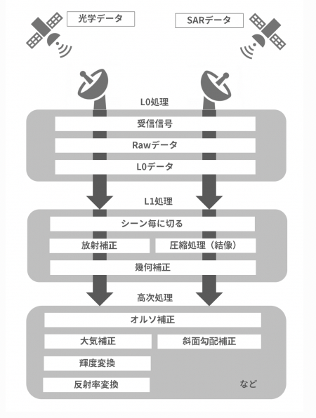
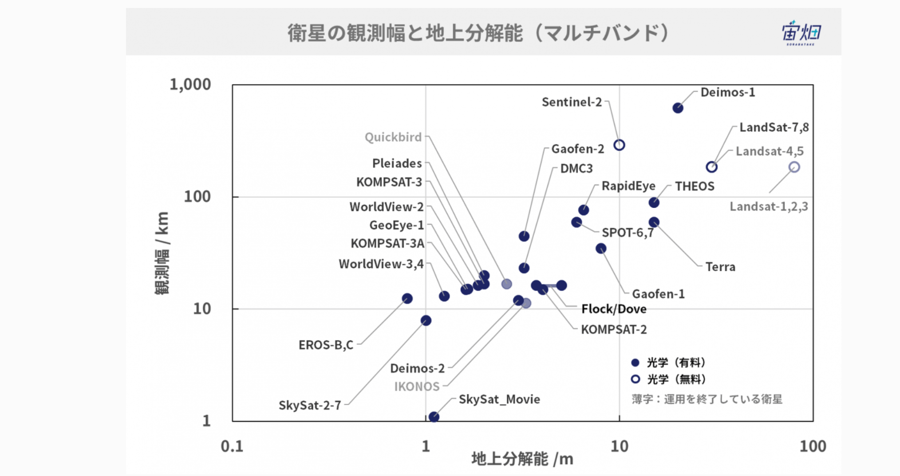
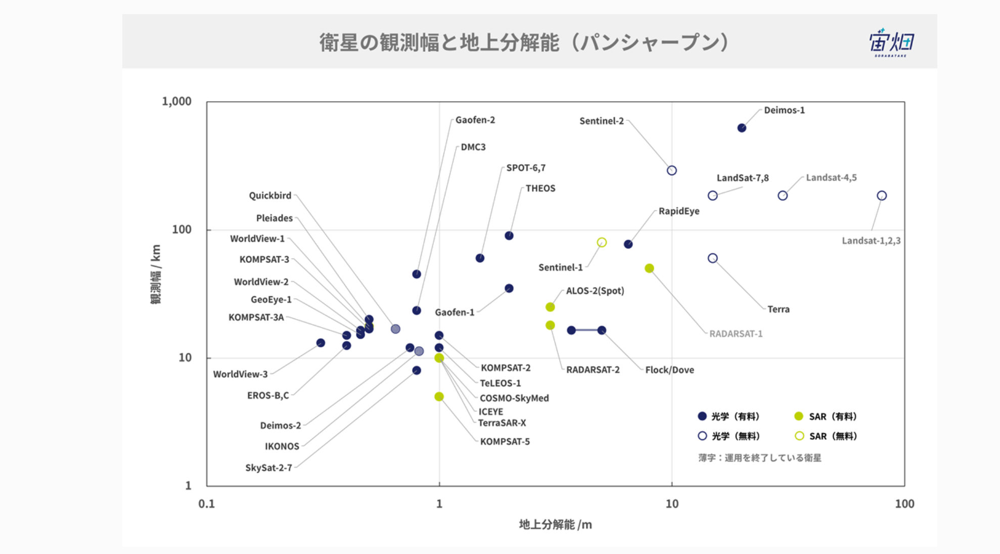
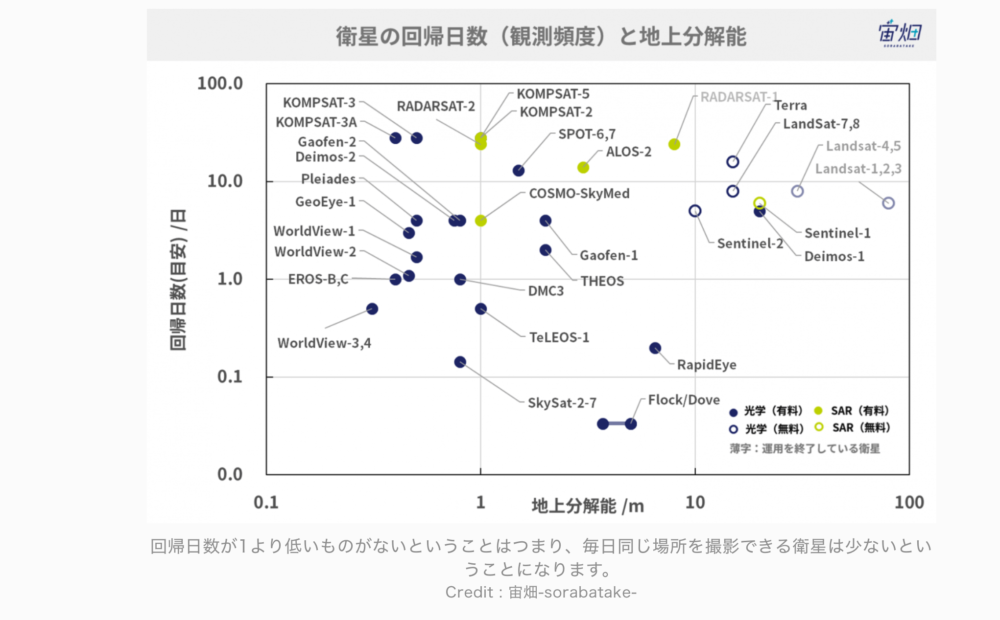
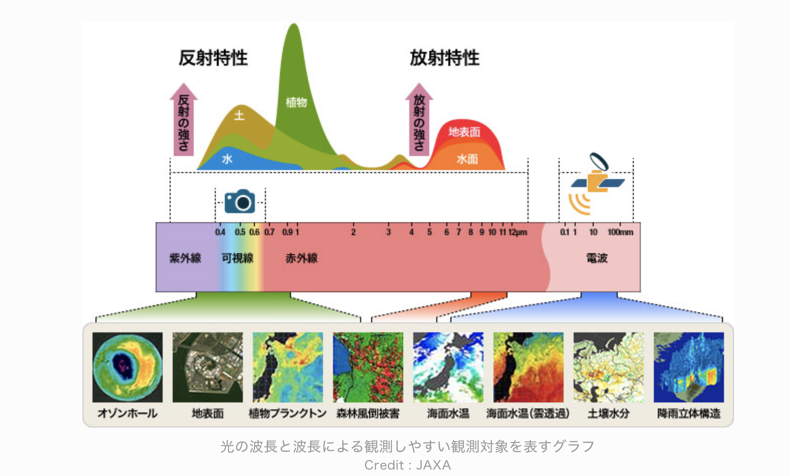
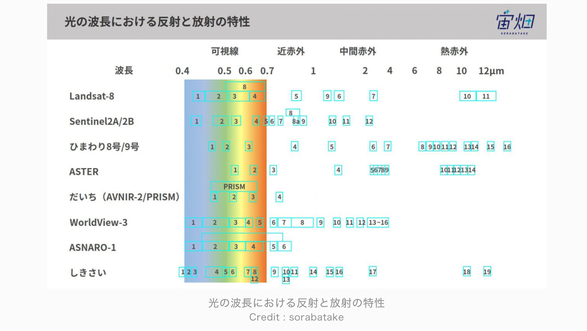

# 衛星データ解析をする上で必要な知識

# 全般

## 衛星画像の基礎知識

- 衛星データの種類（センサの種類、観測周波数）
- 観測頻度（回帰日数）
- 観測エリア（観測幅）
- 解像度（分解能）
  について理解する

宙畑でほぼ学べる

## 衛星のセンサーの違い

- 光学衛星：太陽の光の反射したを観測する。雲や植物の分布など
- マイクロ波衛星：物質から発せられる弱い電磁波（マイクロ波）を観測する。降水量や海面温度など
- SAR 衛星：Synthetic Aperture Radar 合成開口レーダー。電波を衛星が発信しその反射を観測する。雲で覆われていても夜であっても地形や森林の分布を観測できる。

## 分解能

地上分解能 ＝ GSG=Ground Sampling Distance とは、画像１ピクセルの中で地上における Xm の情報を捉えることができるということ。例えば 3m GSD の場合は 3m が１ピクセルとして表現される。世界最高峰の WorldView4(0.3mGSD)でようやく人が確認できるほどで、以下の衛星画像の黒いぽつぽつが人。この画像の価格は 55 万円・・・。

## 観測幅と分解能の関係

大体線形になっており、観測幅が狭い方が分解能の性能も上がる。

## 地理データの知識

- データの種類（ラスターデータ、ベクターデータ）
  [GIS 基礎解説 | ESRI ジャパン ESRI ジャパン](https://www.esrij.com/gis-guide/) 1. ラスターデータ: 行と列の格子状に並んだピクセルで構成されるデータ
  _ 衛星画像などの画像データなど
  _ 拡張子は tiff や bmp 2. ベクターデータ: ポイント(位置)・ライン(道路)・ポリゴン(建物)で表される情報(フィーチャー)を表現するデータ
  _ 拡張子が.shp のいわゆるシェープファイル(shapefile)。シェープファイルでは，ポリゴンなどの 1 つの形(フィーチャー)が 1 レコードとなっている
  _ geopandas というのもある

- 座標参照系（Coordinate Reference System：CRS）
  [Coordinate Reference Systems — QGIS Documentation documentation](https://docs.qgis.org/3.4/en/docs/gentle_gis_introduction/coordinate_reference_systems.html#figure-utm-for-sa)
  データの種類(ラスター or ベクター)にかかわらず，各ファイルが CRS を持っている，つまり座標の仕組みが設定されている必要があります。CRS には以下の 2 種類あります。

1. 地理座標系 (Geographic Coordinate System)
   - 緯度と経度と標高によって表される座標
   - WGS 84 という 1984 年にアメリカが開発した世界測地系が最も有名で，最も使われている。
2. 投影座標系 (Projected Coordinate Reference System)
   - 赤道上のある地点を原点としたときに，対象の場所を(x, y)座標で表す方法

## オルソ補正とは

衛星や航空機による画像 z は、斜め観測や高さのある地形や建物などにより歪みが生じ、そのままの画像では地図に重ねられません。そ こで、地図上に重ね合わせるために正射投影で歪みを補正すること を、オルソ補正といいます。

## ジオリファレンス（Geo-reference）とジオコーデッド（Geo-coded）の違い

ジオリファレンス(Geo-reference)は、処理パラメータで設定した地図投影法に、画像を投影したデータ。 衛星の軌道方向が、画像の上下となる。
ジオコーデッド(Geo-coded)はジオリファレンス画像を回転させ、画像の北方向を画像の上に配置したもの。
・Map North:処理パラメータで設定した地図投影法の北
・True North:真の北(北極点基準)

## Python ライブラリ

- [fiona](https://github.com/Toblerity/Fiona)
  - シェープファイル(.shp)を読み書きするライブラリ
  - geopandas と相性がいい
- [pyshp の shapefile](https://pypi.org/project/pyshp/)
  - fiona 同様に.shp を読み書きするライブラリ
- [Rasterio](https://rasterio.readthedocs.io/en/latest/)
  - 衛星画像(.tif など)を扱うライブラリ
  - データの読み込み，バンドごとの値抽出，画像の大きさ抽出などできる
- [GeoPandas](https://geopandas.org/)
  - Pandas の拡張パッケージ
  - shapefile を読み込め，ベクター情報を変数として格納でき，pandas.DataFrame のように扱える
  - CRS はオブジェクトの属性として格納できる
- [Shapely](https://pypi.org/project/Shapely/)
  - ベクターデータを作成/処理するライブラリ
  - フィーチャー間の関係を真理値で返すメソッドが便利。例えば「点 A がエリア B に含まれてるかどうか」簡単に調べられる。

## 参考

- [人工衛星から人は見える？~衛星別、地上分解能・地方時まとめ~ | 宙畑](https://sorabatake.jp/441/)

# 光学・マイクロ波

## 波長の違いによるデータの特性

波長は長いと遠くまで届くが曲がりにくい。短いと近くで減衰してしまうが曲がりやすい。たとえば電波は波長が長いので遠くまで届きやすいが曲がりにくいので建物の中や影には届きにくい。

- 青い光の波長 0.4μm~0.5μm：土壌分布や、落葉樹と針葉樹の分別、空気中のちり(エアロゾル)の可視化に適している
- 緑の光の波長 0.5μm~0.6μm：植物の活性度を見るのに比較的適している
- 赤い光の波長 0.6μm~0.7μm：水域と陸域の区別、植生が青や緑の波長と比べてよりはっきりとわかる
- 近赤外線の波長 0.7μm~1μm：Near InfraRed=NIR と呼ばれ、これまでの画像に比べるとさらに陸と水がはっきりと区別できる。植物が強く反射するという特徴も持ち、植生を調べる際に良く用いられる。Sentinel2 ではこの近赤外の波長帯をバンドで細かく分けているため、細かい波長の違いで植生を調べることが得意。
- 中間赤外の波長 1μm~6μm：Shortwave InfraRed=SWIR と呼ばれ、水は良く反射し、氷はあまり反射しない。そのため水が多く含まれる低い雲は明るく映り、上空にあり雪や氷の粒が多い雲、雪や流氷などが暗く映る（天気予報に利用）。水域と陸域の違いもかなりはっきりと区別できるため河川を見るのにも適している。地表面では、草地や裸地が比較的白っぽく見え、都心部は暗く見えるため、土壌分布の違いを見ることに利用される。また、火など高温な物体の放射も見える。
- 熱赤外の波長 6μm~13μm：Thermal InfraRed=TIR と呼ばれ、
  6~13μm ほどの波長になると太陽光が地面に反射した光ではなく、物質自身が発する電磁波を捉えることになる。雲や植物も電磁波を発しており、特定の波長を観測することで見えているものが違ってくるため、大気中の成分を調べるのに熱赤外の波長が利用される。二酸化硫黄で火山の様子を捉えたり、二酸化炭素や、火山灰や黄砂に含まれるケイ素などを観測し大気の状況を把握したりできる。

## 参考

- [光の波長って何？ なぜ人工衛星は人間の目に見えないものが見えるのか | 宙畑](https://sorabatake.jp/364/)

# SAR

## SAR の特徴

SAR は観測対象に対して電波を放射し、その反射波の強さで表面の状態を知ることができる。この反射成分を後方散乱と言い、後方散乱が強いほど SAR の画像上では明るく見える。 粗い地表面に電波が照射された場合、表面で散乱が起きるため後方散乱が強くなり、画像上では明るく見える。一方で、水面のように滑らかな面では、ほとんど前方に反射してしまうため後方散乱の強さは弱く、暗く見える。現在 SAR 衛星で観測に用いられる電波の波長は、大きく分けて X、C、L バンドの 3 種類。波長が短い X や C のバンドの電波は、地表の僅かな凹凸、水面のさざ波や森林の枝葉などの細かい構造を見るのに適している。一方で、波長の長い L バンドの電波は細かい構造を一部透過する。木の枝葉を透過しやすいため、地表面の形状を捉えることが可能。

## ４種類の SAR 画像

SAR には、水平振動（H）と垂直振動（V）の２種類がある。送信と受信のどちらにも種類があるため、組み合わせは４種類となる。（HH、HV、VH、VV）各偏波は異なる特性や情報を持っています。例えば、HH は透過性がよく、森林に覆われているような場所でもある程度地面まで届きます。その性質を利用すると、地震や地盤沈下などに伴う地面の 動きを捉えることができます。一方、VV や HV では、例えば森林 を観測したときに、その場所が木々に覆われているのか裸地なのか を知ることができます。なお、HV と VH ではほぼ同じような見え方になります。

SAR の強みの一つは、各偏波から得られた特性の異なる画像をさまざまな手法で合成させることによって、多様な解析ができることです。
ただ、常に 4 偏波すべての画像が得られるわけではありません。 取得できる偏波の数は観測モードによって異なります。最も分解能 が高いモードでは単偏波(HH または VV または HV)しか取れな いものの、少し分解能を下げた、より広域が見られるモードにおい ては 2 偏波、または 4 偏波すべての画像を得ることができます。

## 解析手法

ALOS-2 では、複数の偏波を観測できるモードが増えたため、解析の幅が広がった。具体的な解析手法は以下： - ４つの偏波による結果を合成して情報を引き出す - SAR 画像の差分をとって変化を確認する（InSAR）
時系列要素も含めて多種類のデータの差分を確認する
明るさが常に変化しない点だけを選んで変動を確認することで、微細な地殻変動などを捉えることができる

例えば、パスコがやっている事例では、SAR 画像を CNN で学習させて、土地被覆分類マップを自動生成する。土地被覆分類とは、「人工物」「裸地」「水域」「草地」「森林/樹木」に大別される。
そして、異なる二時期の土地被覆分類マップを比較し、都市の変化状況を抽出することで土地被覆変化マップを生成。します。また、それぞれの状況を地図表現するほか、面積の推計や複数時期の変化過程から都市化や森林減少の速度も推計できる。
→ 干渉 SAR、InSAR と呼ばれる解析手法で時系列画像解析にも近い
[人工衛星データを用いた AI による抽出成果を提供｜株式会社パスコ](https://www.pasco.co.jp/products/satai/)
→AWS や GCP 使えば CNN を勝手にやってくれるかも
なので自分で InSAR 解析できるはず

例えば、同じ場所の複数の画像から多角的に解析できる。
火山活動の解析をする場合、 - 光学画像で噴煙の様子を確認できる - 赤外画像で火口付近の温度状況・変化を確認できる - SAR 画像で火口の地表面の様子を確認できる - 同じ場所を観測した 2 つの SAR 画像を干渉させることで、高度や地表面の変動情報を得ることができる
といったようになる。
[データの見方 | データの利用 | JAXA 衛星利用推進サイト](https://www.sapc.jaxa.jp/use/data_view/)

## SAR データ解析に使えるツール

[STEP – Science Toolbox Exploitation Platform](http://step.esa.int/main/)
ESA が開発しているオープンソースの画像解析 Toolbox

[Web・mobile 用 地図アプリケーション< – MapTiler](https://maptiler.jp/)
GoogleMap と衛星写真を連携して重ねて表示できるアプリ
日本の MIERUNE という会社と協業していて、Qiita にも情報がいくつかある

## SAR 画像のカラー化

疑似カラー化技術では、観測対象の特徴(ザラザラさ、滑らかさ、周辺との類似度、色のばらつき具合など)をピクセルごとに解析する。そしてそれぞれの特徴がどのくらいの程度 なのかを数値で表し、その値を RGB の色の値として置き換えることでカラーリングを実現している。水面、植生、都市部でカラーリングを変えられる。
ただし、あくまで数値を色分けしただけなので実際の色とは異なる。

## SAR 関連のライブラリ

- PyRate
  [PyRate documentation — PyRate 0.6.1 documentation](https://geoscienceaustralia.github.io/PyRate/)
  [GitHub - GeoscienceAustralia/PyRate: A Python tool for estimating velocity and time-series from Interferometric Synthetic Aperture Radar (InSAR) data.](https://github.com/GeoscienceAustralia/PyRate)

- LiCSBAS
  [GitHub - yumorishita/LiCSBAS: LiCSBAS: InSAR time series analysis package using LiCSAR products](https://github.com/yumorishita/LiCSBAS)
  [LiCSAR 製品を使用して InSAR 時系列分析を実行するための LiCSBAS パッケージ - wenyanet](https://www.wenyanet.com/opensource/ja/5fedb5f89c1222717e360f1b.html)
  [Remote Sensing | Free Full-Text | LiCSBAS: An Open-Source InSAR Time Series Analysis Package Integrated with the LiCSAR Automated Sentinel-1 InSAR Processor](https://www.mdpi.com/2072-4292/12/3/424)

- MintPy
  [GitHub - insarlab/MintPy: Miami InSAR time-series software in Python](https://github.com/insarlab/MintPy)

## 役立ちそうな論文

- [Remote Sensing | Free Full-Text | GECORIS: An Open-Source Toolbox for Analyzing Time Series of Corner Reflectors in InSAR Geodesy](https://www.mdpi.com/2072-4292/13/5/926)
- https://www.gsi.go.jp/common/000207740.pdf

## 参考

- https://www.sapc.jaxa.jp/use/data_sample/images/ALOS_JP_web.pdf
