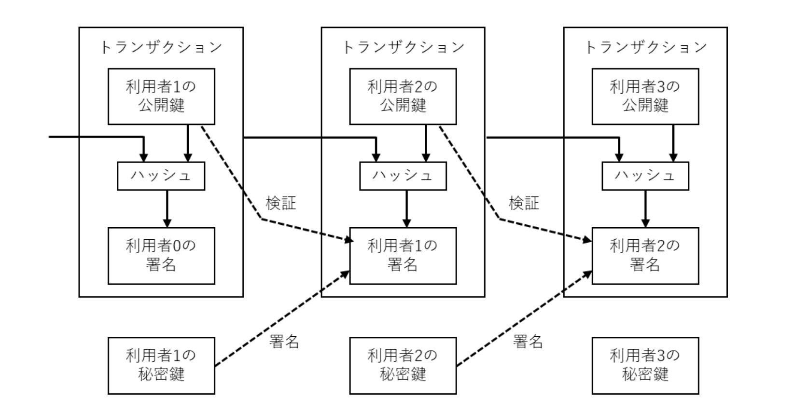

# ブロックチェーンの基本を理解する

## ブロックチェーンとは

### ブロックチェーンの特徴

複数のコンピュータによってデータを共有し、データを改竄から守り透明性を高くするデータベースの一種。パブリックブロックチェーン によってインフラが保たれている。

以下の特徴をもつ。

```
1. 取引データが暗号化されている
2. 合意された過去の取引データの集合体がチェーン上に記録されている
    トランザクションデータをブロックという単位で保持し、それをチェーンでつないでいる。
3. データの改ざんが難しい仕組みを持つ
    電子署名とハッシュを利用しているため、改竄を容易に検知できる。
4. 中央管理者がおらず、分散的に運用されている
    ビットコインなどを利用しているあらゆるユーザーのコンピューターに保存される。一元管理されていないのでシステムが実質的にダウンしない。
    GAFAのように独裁的なコントロールはできない。
5. ネットワーク上の複数のコンピュータが取引データを確認・合意するために送受信する
    データを複数のノードで分散保持し、高可用性と同一性を実現している。
6. システムダウンが起こりにくい
```

例えば、A から B にビットコインを送金する場合、取引のデータは暗号化されて一つのブロックに記録される。



出所) [世界で最初にビットコインについて発表された SatoshiNakamoto の論文](https://bitcoin.org/files/bitcoin-paper/bitcoin_jp.pdf)

### トランザクションの流れ

> 取引データ（履歴）である「トランザクション」には、*「何月何日に A から B へ ○○BTC を送金した」*という内容のデータが記録され「ブロック」になります。このデータはオープン化されているため、誰でも確認することができます。しかし、トランザクションの「具体的な取引内容」はハッシュ関数によって「暗号化」されるという特徴があります。

仮想通貨ごとにトランザクションを確認できるサイトがある。

- ビットコイン：https://btcscan.org/
- イーサリアム：https://etherscan.io/

ただし、ブロックチェーンの分散管理という特徴から、トランザクションごとのリアルタイム更新は実現できない。10 分単位でまとめて承認作業が行われている。

承認については後述。

### ブロックの中身

ブロックには、

- 取引データ：いつ、誰が、どのくらいの量を取引したのか
- ハッシュ値：過去全ての取引を数珠つなぎで暗号化したデータ
- ナンス値：マイニングに使われる数値（計算して算出するデータ）
  という３種類のデータが入っている。

このブロックをハッシュ化し、次のブロックに組み込むことでチェーンを実現し、過去全てのデータが入っているということになる。

  <details>
  <summary>ナンス値とマイニングについて</summary>
  <div>
    <div>
    ビットコインではその生成されたハッシュ値の文字列が特定の数値より小さくなければならない。そのため、文字列の先頭が「000…」となるようにいくつも 0 が並ぶようにする、というルールを持たせている。この特定のハッシュ値を生成するために使われるのがナンス値。
    </div>
    <br/>
    <div>  
    ① 取引データと ② 一つ前のブロックのハッシュ値、に加えて、③「ナンス値」という数値を入れて、生成されたハッシュ値が特定の値より小さい（先頭に 0 がいくつもならぶ）数値になるまで何度もナンス値を変えながら同じ計算を繰り返す。
    こうして正しいナンス値を探し当てる作業をマイニングと言い、マイニングする者をマイナーと言う。
    ハッシュ関数は、任意のデータから規則性のない文字列を生成する関数であり、出力値を予め予測することは出来ない。したがって、数値をひとつずつ当てはめていく膨大な計算量が必要であり、大量のコンピュータと電力が必要とされる。  
    </div>
    <br/>
    <div>
    そして、最初に正しいナンス値を発見したマイナーは、新しいブロックをブロックチェーンに書き込む権利を得る。新しいブロックが書き込まれることで「承認」となり、その報酬としてマイナーには一定額のビットコインが支払われる。
    </div>
    <div>
    ただし、多くの人がマイニングしているため同時に複数のブロックが生まれることもあり得る。この事象はフォークと呼ばれ、フォークが発生した時には「最も長いチェーンに含まれるブロックが正しい」というルールになっている。
    </div>
  </div>
  </details>

### ハッシュ化のメリット

ハッシュ関数（SHA-256）によってブロックはハッシュ化される。このハッシュ関数の特徴とメリットは以下。

| 特徴                                                   | メリット                       |
| ------------------------------------------------------ | ------------------------------ |
| 元データが少しでも変わるとハッシュ値はガラッと変わる   | 類推できないため耐改竄性が高い |
| 元データのサイズによらず、ハッシュ値の桁数は一定になる | データの軽量化                 |

### 理論上改竄不可能な理由とコンセンサスアルゴリズム

#### 改竄が不可能なのではなく非合理的な理由

一つのブロックのデータを改ざんした場合、そのブロックの後に続くブロックのハッシュ値が変わってしまう。そのため、改ざんしようとする取引データだけではなく、後続のブロックのハッシュ値もすべて計算し直す必要が生じる。

改ざんのための計算は、厳密には可能だ。だが、そのためにはマイニングのために莫大なコスト（大量のマイニングを高速で行うコンピュータや電気代）を必要とするため、そのコストを負担してまで改ざんを行おうという人物は現れないと考えられる。

多大なコストを掛けて不正を働くより、むしろマイニングに取り組んで報酬を得るほうが経済合理的であり、わざわざ改ざんを行うインセンティブが働かない。「ブロックチェーンは改ざん不可能」と言われるとき、「理論上」という冠が付いているのはこのため。

そして、マイニングの計算作業には競争原理が働いているため、多数のマイナー達が悪意を持って結託することも考えにくい。このように、マイナーが暗号化されたデータを見つけ出す作業に競争原理を持ち込み、さらにマイナーに報酬というインセンティブを与えることで取引の整合性を証明していく仕組みを PoW（Proof of Work=仕事による証明）と呼ぶ。PoW はビットコインのコンセンサスアルゴリズム。

#### コンセンサスアルゴリズム

> ノードは、「コンセンサスアルゴリズム」と呼ばれる合意形成のルールに基づいて、特定の条件を満たすことでブロックを生成することができます。
> コンセンサスアルゴリズムとは、中央管理者が不在であるブロックチェーンにおいて「どのデータが正しいか？」を決めるための、不特定多数のノードによる合意方法のことです。

コンセンサスアルゴリズムは、ブロックチェーンによって異なる：

- ビットコイン：PoW（Proof of Work、プルーフオブワーク）
- イーサリアム：PoS（Proof of Stake、プルーフオブステーク）
- ネム： PoI（Proof of Importance、プルーフオブインポータンス）
- リップル：PoC（Proof of Consensus、プルーフオブコンセンサス）

### スマートコントラクトとは

> スマートコントラクトとは、ブロックチェーンシステム上で、規定のルールに従ってトランザクションや外部情報をトリガーに実行されるプログラムあるいはコンピュータプロトコルのことで、1994 年に Nick Szabo（ニック・スザボ）という法学者・暗号学者によって提唱され、Vitalik Buterin（ヴィタリック・ブリテン）が Ethereum 基盤上で開発・提供され始めました。https://trade-log.io/column/1313

> 自動販売機は、その名の通り、人の手を介さずに自動で飲料を販売する機械であり、① 指定された金額分の貨幣の投入、② 購入したい飲料のボタンの押下、という 2 つの条件が満たされることで自動的に「販売契約」が実行されます。自動販売機自体はとてもシンプルな仕組みですが、「契約の事前定義 → 条件入力 → 履行 → 決済」という一連の流れを全て自動化しているという点でスマートコントラクトの好例と言えるでしょう。

> 決済期間の短縮や不正防止、仲介者排除によるコスト削減といった目的で用いられています。

> スマートコントラクトによって契約に関わる第三者機関（仲介者）を通さず、約定照合や契約状況の把握ができるため既存の契約業務を自動化できます。

### DEX とは

DEX（Decentralized Exchange、分散型取引所）とは、イーサリアムなど一部のブロックチェーンネットワーク上で展開される暗号資産（＝仮想通貨）の取引所の１つ。

従来の CEX（Centralized Exchange、集中型取引所）では、ある企業が中央集権的に運営し、取引に必要な秘密鍵の管理は第三者機関に委託した。
それに対し、DEX では暗号資産を取引したい人同士が自身の秘密鍵を使って直接取引（スマートコントラクト）するため、ユーザー自身が秘密鍵の管理を行うことになる。

メリット：

- 外部からのクラッキングや中央集権機関の人為的ミスによる秘密鍵の流出がない
- 自動取引のため手数料が安くなる

デメリット：

- ユーザー数が少ないためにアセットの流動性が低い
- 中央管理者がいないため自己責任が求められる

## ビットコインとは

### 論文

世界で最初にビットコインについて発表された SatoshiNakamoto の論文
https://bitcoin.org/files/bitcoin-paper/bitcoin_jp.pdf

ブロックチェーン上に各トランザクションをハッシュ化してタイムスタンプをする
Proof-of-work の計算が肝
このタイムスタンプは計算を再度行わないと変更不可能な記録になる

必要なのは信用ではなく、暗号学的証明に基づいた電子取引システムであり、これにより 信用の置ける第三者を介さずに、利用者間の直接取引が可能となる。

本論文では、取引が時系列に行われたかについて、計算に基づ いた証明を生成する P2P 分散型タイムスタンプサーバを使用し、二重支払い問題の解決策を提案する。

本システムは、善意のノードが攻撃者グループのノードを上回る CPU パワーをコントロールしている限り安全である。
→？？？

難しい、、、
初心者向けの解説を見てから戻ってくるしかない、、、

### ビットコインの稼働マシン

以下のサイトにて確認できる

https://bitnodes.io/

<details>
<summary>ビットコインの半減期</summary>
<div>
  マイニングによるビットコインの報酬額は「半減期」と呼ばれる時期に定期的に半額に引き下げられる仕組みになっている。マイニングが行われるたびにコインが発行され、通貨の総流通量が増えると、希釈化により価値が下がってしまうからだ。つまり、「半減期」とは、「マイニング報酬が半額に減額されるタイミング」のことを意味する。ビットコインの発行総量は事前に決められており、2140年までに2,100万BTC（上限数）に達すると言われている。
</div>
<br/>
<div>
  <a href="https://academy.binance.com/ja/halving">Bitcoin 半減カウントダウン | Binance Academy</a>
</div>
</details>

# 参考

- [ブロックチェーンとは？仕組みやメリット、企業の活用事例など基礎知識を解説｜ ferret](https://ferret-plus.com/7706)

EOF
