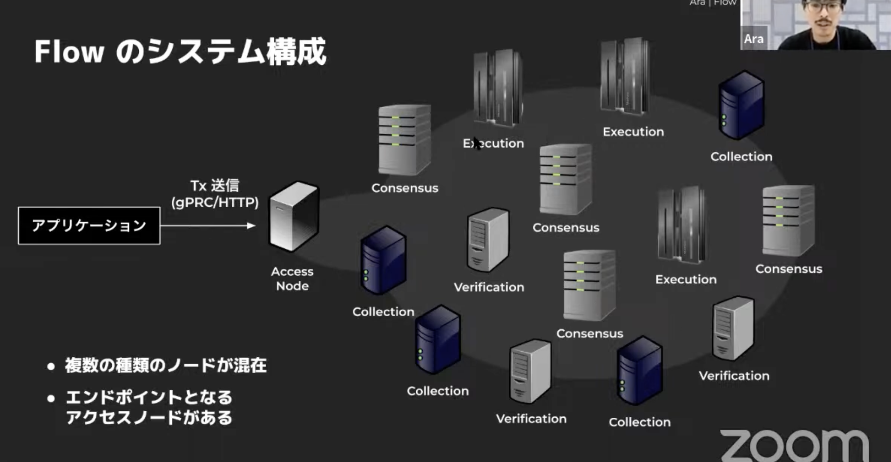
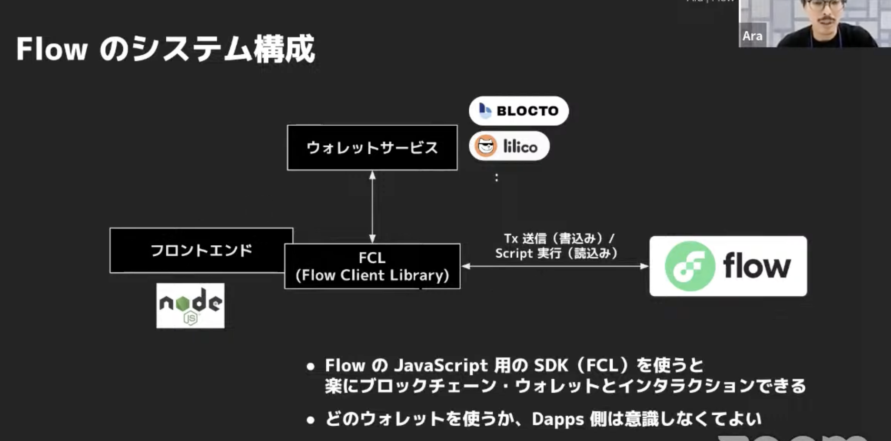

# 01.Flow と Cadence

# Flow の特徴

- ブロックチェーンの専門家ではなく、一般人に向けて開発されている
- デジタルアイテムの「所有」を実現したいというモチベーションで開発がスタートした
- リソース指向の言語で開発できる

- 見ておくべき TED Talk: https://www.youtube.com/watch?v=u894J50AqOs

- ４種類のノードが存在する

  - Collection, Consensus, Execution, Verification
  - マシンスペックに応じて、４種類の役割を分担することで、効率的な処理を実現している

- エンドユーザーが使うアプリケーションからのアクセスは最初に Access Node が受け、その後、４種類のノードにトランザクションが送られる仕組み




## cadence のプレイグラウンド

スマートコントラクトを実際に書いて試せる Palyground を Flow 公式が用意している

https://play.onflow.org/local-project

## cadence の特徴

- 強力な静的型付け言語

  Swift や Kotlin、TypeScript など最近の構文を取り入れている

- リソース指向プログラミング

  リソースが一度に一箇所にしか存在できない、コピーできない、削除されない、といった特徴がある。これによってデジタルの所有権をモデリングしやすくなっている

- 関数とトランザクションの前後条件

  関数とトランザクションの前後に条件を記述して、テストができる

- 更新可能

  一定の条件下でコントラクトをアップデート可能

- 最小権限の原則

オブジェクトへのアクセスは所有者と参照を持つものに制限される

## 理解しておくべき用語

- アカウント

  ユーザーが持っているコントラクトとストレージ。通常はウォレットに格納して利用する。

- コントラクト

  各アカウントのストレージに格納されているインターフェース、構造体、リソース、データ（アカウントの状態）、利用できる関数をひとまとめにしたもの。

- アセット

  ブロックチェーンを使って所有権を主張したいモノそのもの。

- リソース

  独自に定義されたフィールドと関数を持つ複合型。

- トランザクション

  コントラクトをオンチェーンで実行するプログラム。

## アカウント

- アカウントとは、Flow ブロックチェーンを扱う上での個人個人がデータを管理するためのもの
- Flow では秘密鍵を複数持てる（multi sig)
- Flow ではアカウントは２つの領域に分かれている
  - コントラクト領域
    - スマートコントラクトのプログラムを格納する領域
    - アカウントの所有者はここにコントラクトをデプロイし、更新できる
    - トランザクションはこの領域には直接アクセスできない
    - 他のコントラクトから利用するためには専用のインターフェースを定義する必要がある
  - ファイルシステム
    - アカウントが所有するオブジェクトとそのアクセスを制御できる capability（実行可能な関数の一覧）を格納できる
    - トランザクションによってアクセスできる
    - ファイルシステムの root として `storage` `private` `public`という３つのドメインだけ指定できる
      - `storage`: 全てのオブジェクト（token や NFT など）を保存する。アカウントの所有者のみがアクセスできるようになっている
      - `private`: アセットの capabilities（実行可能な関数の一覧）を保存する。capabilities の中の関数を使ってオブジェクトの参照などが可能になる。アカウントの所有者とアクセス権を持っている人だけがアクセスできる
      - `public`: ネットワーク内の誰もがアカウントの情報を参照できるような capabilities（実行可能な関数の一覧）を保存する
    - `private`と`public`の関数を使ってトランザクションコードを作成し、`storage`へアクセスするイメージ

## コントラクト

https://developers.flow.com/cadence/language/contracts

cadence におけるコントラクトとは、各アカウントのストレージに格納されているインターフェース、構造体、リソース、データ（アカウントの状態）、利用できる関数をひとまとめにしたもの。

コントラクトは、アカウントのオーナーが追加、更新、削除できる。

加えて、Authorized Accounts も `contracts`オブジェクトを使えば、追加、更新、削除できる。

コントラクトのサンプル：

```cadence
pub contract HelloWorld {

    // Declare a stored state field in HelloWorld
    pub let greeting: String

    // Declare a function that can be called by anyone
    // who imports the contract
    pub fun hello(): String {
        return self.greeting
    }

    init() {
        self.greeting = "Hello World!"
    }
}
```

各アカウントのコントラクトは、トランザクションや他のアカウントから `import`することによって利用できる。ただし、`pub`がついている変数や関数のみ。

```cadence
import HelloWorld from 0x42

log(HelloWorld.hello())    // prints "Hello World!"
log(HelloWorld.greeting)   // prints "Hello World!"

// Invalid: Cannot call the init function after the contract has been created.
HelloWorld.init()    // Error
```

`pub`以外にも細かくアクセス制御ができる。詳細は https://developers.flow.com/cadence/language/access-control に記載されている。

pub / access(all) > access(account) > access(contract) > private

の順にスコープが狭くなる

## トランザクション

https://developers.flow.com/cadence/language/transactions

- トランザクションとしてオンチェーンで実行させたいプログラム
- データの変更が伴う処理に利用され、そのためにはそのデータの更新権限を取得する必要がある
- データの更新権限を付与するには、トランザクションのプログラムに対して、対象データを保存しているアカウントが秘密鍵で署名する必要がある
- そうすることで、署名したアカウントのストレージにプログラムがアクセスできるようになる
- 署名したアカウントは authorizers や signers と呼ばれ、例えばアカウント A とアカウント B で NFT の所有者を変更したい時には、アカウント A と B でトランザクションを承認(sign)することになる
- ガス代がかかる

トランザクションコードの例：

```cadence
import HelloWorld from 0x01

transaction {
	prepare(acct: AuthAccount) {}

    // In execute, we simply call the hello function
    // of the HelloWorld contract and log the returned String.
	execute {
	  	log(HelloWorld.hello())
      log(HelloWorld.greeting)
	}
}
```

## スクリプト

- トランザクションとは異なり、データの変更が発生しない、情報を参照するだけの処理のことを指す
- そのため、承認のプロセスは発生しない
- ガス代はかからない

## リソース

リソースとは、データと関数の集まりであり、構造体や Class に似ている cadence 独自の考え方。

違いはコピー不可な点。コピーができないことで、所有権を表現することに使える。

リソースは以下のルールに従うよう作られている。

- １つの場所にだけ存在できる（コピーして同時に複数の場所に存在することはできない）
  - 場所とは、アカウントのストレージや、関数実行中の変数の中、コントラクトのストレージフィールドなどを指す
- リソースはアクセスがあったときに確実にある場所から他の場所への移動しなければならない（アクセスがあったとき？？？）
- リソースはスコープの外側には移動できない。どこかに保存するか、破壊するかを明示しなければならない。

このルールに従うことで、コーディングミスによるリソースの紛失やリソースのコピーを防ぎ、所有権の主張ができる状態を生み出している。

Cadence では、リソース（≒ アセット）をアカウントのストレージに保存し、アセットの所有権をアカウントに直接結びつけている。トランザクションが稼働するマシンのストレージを使わないため、アカウント間で自由にアセットを転送できる。イーサリアムなどでは、所有権がスマートコントラクトに保存されるため、アセットの追跡のために全てのスマートコントラクト（つまりトランザクション）を検索する必要がある。

## 開発する時には

### 開発の流れ

- スマートコントラクトを実装する
  - 実装
  - エミュレータ環境でテスト
  - テストネット環境にデプロイして動作確認
  - メインネット環境にデプロイして動作確認
- フロントエンド/バックエンドを実装する
  - Flow Client Library（JavaScript）や Flow Go SDK を利用

### Flow CLI

- エミュレータ、テストネット、メインネットでの開発に使えるコマンド
- `flow emulator`でエミュレータを起動したり
- `flow deply`でコントラクトをデプロイしたり
- といった使い方ができる

### 参考にできるソースコード

- cadence で書かれた NFT マーケットプレイスのサンプルプロジェクト

  https://github.com/onflow/kitty-items

  これをベースに自社サービス用にカスタマイズすれば OK なのかも

- NBA Top Shot のコントラクトの実装

  https://github.com/dapperlabs/nba-smart-contracts

- FanTop のコントラクト部分

  https://github.com/mediadotech/smart-contracts

### Flow の人がレビューしてくれる

- 自分で開発したスマートコントラクトは、最終的にセキュリティ上のリスクがないか Dapper Labs 社の Flow チームが直々にチェックしてくれる
- レビューの過程では、それぞれの定義の要件やどのように設計したのかを文面で確認されるそう
- 最終的に OK になれば、Flow の人がメインネットにデプロイしてくれる

### テストネット

- Flow のテストネット：https://docs.onflow.org/concepts/accessing-testnet/

# 参考

- [Flow ブロックチェーンと Cadence 言語の実用 ― FanTop の裏側](https://techdo.mediado.jp/entry/2022/05/11/150000)
