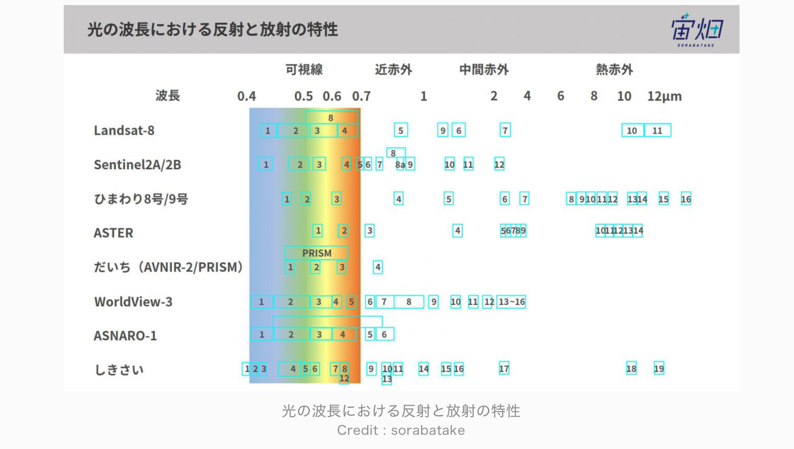
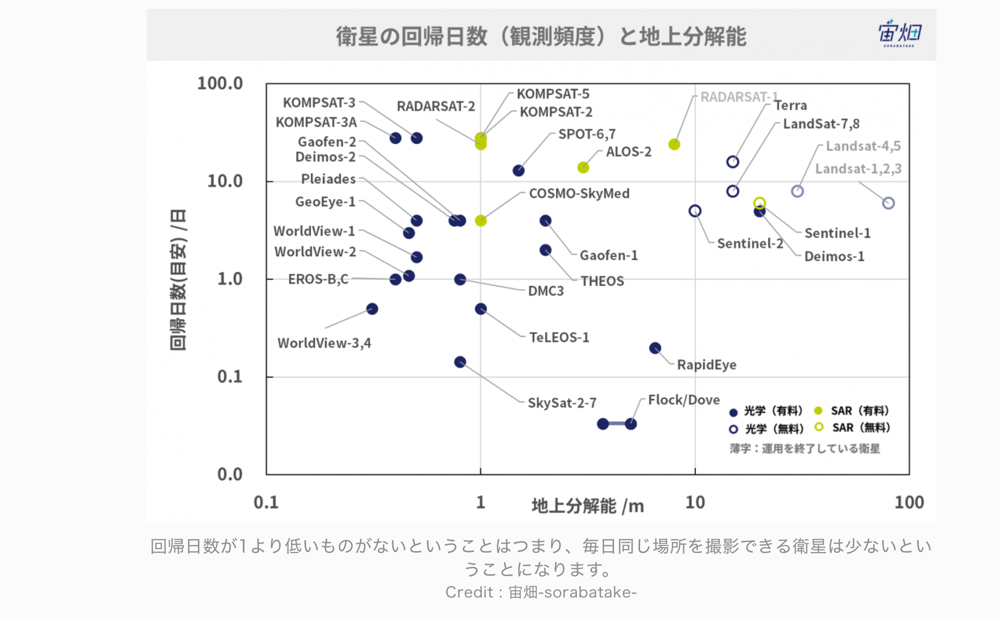

# リモートセンシングの波長・センサ・座標

## 波長

### 電磁スペクトル

電磁波（電場と磁場が直行し振動しながら進むエネルギー波）を利用して地球の様子を確認する手法がリモートセンシング。

物質が光を特徴的に吸収、放射、反射する特性を活かしている。例えば、植物に含まれる葉緑素は赤や青の光を吸収するが、緑や赤外光線は反射する。物質に特有の吸収や反射のパターンを Spectral Signature と呼ぶ。

### ナノ波（可視光を含む）

#### 波長帯の分類

波長帯(nm) | 呼称 | 抽出対象
--- | --- | ---
450 ~ 490 | 青 | 水面、都市・道路などの人工物
490 ~ 580 | 緑 | 植物、水中の沈殿物
620 ~ 780 | 赤 | 鉱物、土壌、植物の生育状態
700 ~ 1100 | 近赤外線（NIR）| 水、植物
1100 ~ 3000 | 短波赤外（SWIR） | 水、土壌水分、雲、雪、熱、ミネラル
3000 ~ 5000 | 中波赤外（MIR） | 熱放射、海面/地表面温度
8000 ~ 15000 | 熱赤外(TIR) or 長波赤外(LWIR) | 水、地表面温度、水蒸気

#### 各波長の詳細

青色の波長(450から490 nm)は

	- 大部分が水に吸収される
	- 水面の特徴や海や湖の浅いエリアを抽出することに役立つ
	- 都市や道路などの人工物も青色の光でよく捉えることができる

緑の光(490から580 nm)は

	- 植物プランクトンや植物を観測できる
	- これらの生物に含まれる葉緑素は赤や青を吸収し緑を反射する
	- 水中の沈殿物も同様に緑の光を反射する
	- 水中の泥や砂の層は青と緑の波長をどちらも反射するため、他の対象物より鮮やかに映る

赤色の波長(620から780 nm)は

	- 鉱物と土壌を判別する助けになる
	- 鉱物の含有量に影響を受ける
	- クロロフィル（葉緑素）は赤色を吸収するため植物/農作物の成育モニタリングすることに使える
	- 赤色の波長は細かく判別をすることには向かないが、植物の分類を行なう場合にも利用することができる

近赤外線（NIR）（700から1,100 nm）は

	- 水は近赤外線をよく吸収するため、可視光領域では明確にならない陸域と水域の判別をする際に役立つ
	- 河床や湿地が暗い色になる
	- 植物は対照的に近赤外を強く反射し、特に健康状態の良い植物ではそれが顕著になる
	- この波長は大気中のチリなどを通り抜けるため、もやがかったような画像の詳細を捉えることにも適している

短波赤外（SWIR）（1,100から3,000 nm）は

	- 1,400、1,900そして2,400 nmの三つの領域では水は短波赤外によく吸収される
	- 例え土中であってもその水分量を濃淡で表現することが可能
	- そのため土壌や植物中にどのくらいの水分が含まれているのかを見積もる場合に役立つ
	- 雪や雲のタイプを区別するのにも使える
	- 熱に対する感受性が高く、燃焼が生じた土地でより反射されるため、火事被害の進行具合がわかる
	- 岩石に含まれるミネラルは各々が異なった反射特性を持ち、これもSWIRを用いて観測することが可能
	- 下図では砂岩や石灰岩で構成された山岳地帯をSWIRを利用して画像としたもの

中波赤外（MIR）（3,000から5,000 nm）は

	- 主として夜間における熱放射を観測するために用いられる
	- この波長は海の表面温度、雲や火事を調べるためにも使用される
	- 下図では夜間において中波赤外領域の波長を用いて観測したもの
	- 夜間で冷えた地面や雲は暗く、相対的に暖かい海や川が白く表現されている
    

熱赤外(TIR)もしくは長波赤外(LWIR)（8,000から15,000 nm）は

	- 地球から熱として放出されたもの
	- この波長帯では水を捉えたり、地表面温度を捉えることに用いられる
    - 地熱のマッピングや火事など、熱を放出している対象を捉えることに向いている
	- 植物の蒸散による水蒸気が上空の空気を冷やすことを利用し、植物がどのくらいの水を利用したのかを調べるためにも用いられることがある
	- 下図はは同一地点をSWIRを用いた衛星画像とTIRを用いた画像で比較したもの
    - 左図（SWIR）に比べて右図（TIR）では溶岩をはっきりと捉えている

#### トゥルーカラーとフォルスカラー

- トゥルーカラー（True color）：赤、緑、青(RGB)の光で組み合わされています。人間の目で捉えた世界に似た画像となります。
- フォルスカラー（False color）：上記以外の組み合わせで色の波長を割り当てた画像。

#### フォルスカラーの使い方

- Rに短波長赤外線、Gに赤、そしてBに緑の波長を割り当てたイメージでは、遠赤外線の反射が異なるため、植物がどの程度よく成育するのか、そしてどの程度生い茂っているのかを考えることが可能になる
	- 植物は遠赤外線をよく反射するため暗い赤で示され、その一方で成長が早い植物は、より多くの遠赤外線を反射するため明るい赤色を呈することになる
	- 水は黒か青で表現され、都市域は銀色（白色）となる
- 他には近赤外(R)、赤(G)、緑(B)で割り当てられたもの、短波赤外(R)、近赤外(G)、緑(B)を割り当てられたものなど、赤外波長が含まれているものとなります。

### マイクロ波

#### マイクロ波の概要

- マイクロ波によるリモートセンシングでは、能動と受動の二つのタイプが存在
- マイクロ波は、約1cmから1mの範囲にある波長（SARで用いられる波長帯）
- 可視光や赤外領域と比べ長い波長を持ち、そのため雲や大気中のチリにより地面が捉えづらい場合でも、それらを通り抜けて観測をすることが可能

#### SARとは

- マイクロ波を能動的に発射し、その反射から地球の状態を見る手法
- 反射を後方散乱と言い、この後方散乱の程度によってどんな地表面になっているかを把握できる
	- 粗い地表面に電波が照射された場合、表面で散乱が起きるため後方散乱が強くなり、画像上では明るく見える
	- 水面のように滑らかな面では、ほとんど前方に反射してしまうため後方散乱の強さは弱く、暗く見える

#### 偏波

- SARセンサの電波はその振動方向によって、垂直偏波・水平偏波に分けられる
	- 水平偏波Horizontal(H)もしくは垂直偏波Vertical(V)を発信し、反射して返ってきた電波を水平(H)、または垂直(V)で受信する
	- 組み合わせは４種類となる（HH、HV、VH、VV）
- 物体の特性（表面特性や塩分の含有量など）によって、入射した電波をどう反射するかが異なるため、画像にしたときに反射の強さが異なる
	- ビルなど整った表面が多いところでは波の向きが変わらずに返ってくるのでHH/VVの信号が大きくなり、HV/VHの信号は小さくなる
	- 森林など凹凸の大きい表面では波の向きがぐちゃぐちゃになって返ってくるので、HH/VVの信号は弱くなり、HV/VHの信号が比較的強くなる
- ただし、常に 4 偏波すべての画像が得られるわけではない
	- 取得できる偏波の数は観測モードによって異なる
	- 最も分解能が高いモードでは単偏波(HH または VV または HV)しか取れない
	- 少し分解能を下げた、より広域が見られるモードにおいては 2 偏波、または 4 偏波すべての画像を得ることができる

## センサー

### 軌道と観測幅と分解能

- 地球観測衛星が周回する代表的な軌道は、極軌道と静止軌道
- 極軌道は北極と南極付近を、静止軌道は赤道上をそれぞれ周回している
- 極軌道
	- 極軌道の場合は90~100分ほどで地球を周回している衛星が多い
	- 地球を一日に15~16周
	- ただし同じ場所を毎周とれるわけではないため、回帰日数が短いとは言えない
- 静止軌道
	- 静止軌道の衛星は常時同一地点を観測できる
	- 軌道高度が高いため広い視野を確保でき、観測幅が広くなる
	- ただし観測する分解能は悪くなる

- 画像のパラメタは以下のように多くの条件がある
	- 特に観測バンドと分解能が重要

- 地上分解能 ＝ GSG=Ground Sampling Distance とは、画像１ピクセルの中で地上における Xm の情報を捉えることができるということ。例えば 3m GSD の場合は 3m が１ピクセルとして表現される。世界最高峰の WorldView4(0.3mGSD)でようやく人が確認できるほどで、以下の衛星画像の黒いぽつぽつが人。この画像の価格は 55 万円・・・。

大体線形になっており、観測幅が狭い方が分解能の性能も上がる。

### センサーの種類
    
- センサは以下２つに大別できる
	1. 衛星自体が能動的に電波等を発し、その反射を観測する能動的センサ
	2. 太陽光の反射や物体が発する電磁波を観測する受動的センサ

- センサーは [スプレッドシート：衛星に搭載されるセンサーの違い](https://docs.google.com/spreadsheets/d/1x0C9L5XUk3cgX8cidPTEcnUdodvgMzvr9zbHOq17Hxs/edit?usp=sharing) に整理している

## 座標

### 概要

- 座標については、座標参照系（Coordinate Reference System：CRS）と総称されている。
- データの種類(ラスター or ベクター)にかかわらず各ファイルが CRS を持っている、つまり座標の仕組みが設定されている必要がある。

	[Coordinate Reference Systems — QGIS Documentation documentation](https://docs.qgis.org/3.4/en/docs/gentle_gis_introduction/coordinate_reference_systems.html#figure-utm-for-sa)

### 直交座標系(Cartesian Coordinate System)
- 原点を中心として、ある地点がX軸とY軸上のどの場所にあるのかを決定

### 地理座標系(Geographic Coordinate System)
- 緯度と経度と標高によって表される座標
- WGS 84 という 1984 年にアメリカが開発した世界測地系が最も有名で、最も使われている。

	[測地系 | ESRIジャパン座標系/空間参照 | GIS 基礎解説 | ESRIジャパン](https://www.esrij.com/gis-guide/coordinate-and-spatial/datum/)

- 様々な方法を利用して「楕円な」地球の地理情報を平面に置き換えている
- 衛星画像を地図上の適切な位置に描写するためには、その地図が投影されたのと全く同じ方法で衛星画像を平面上に配置する必要があり、GISアプリケーションではこれらの情報をCRSとして操作することが可能
- 重要なことは、地球を理想的な楕円体と考えるために使用した測地系と、地理座標系の情報を平面上に変換するために利用した投影方法を把握すること

### 投影座標系 (Projected Coordinate Reference System)

- 赤道上のある地点を原点としたときに，対象の場所を(x, y)座標で表す方法

### ジオリファレンス（Geo-reference）とジオコーデッド（Geo-coded）の違い

- ジオリファレンス(Geo-reference)は、処理パラメータで設定した地図投影法に、画像を投影したデータ。 衛星の軌道方向が、画像の上下となる。
- ジオコーデッド(Geo-coded)はジオリファレンス画像を回転させ、画像の北方向を画像の上に配置したもの。
	- Map North:処理パラメータで設定した地図投影法の北
	- True North:真の北(北極点基準)

