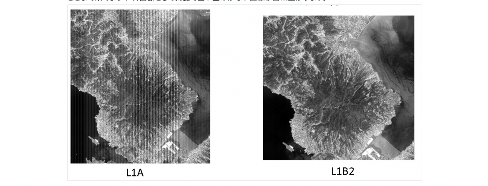

# 衛星データの処理・解析

## データ処理

### 光学データ

#### L0 処理

1. 電波受信：衛星からの電波をアンテナで受信
2. データ変換：伝送向けに加工されたデータを Raw データ（元の信号）に戻す
3. データ整形：Raw データから余計な情報を削ぐ

#### L1 処理

1. 切り出し：帯状になっているデータを扱いやすい大きさに切る。AVNIR2 では L1A と呼ばれる。
2. 放射補正：同じセンサの素子ごとにばらつきが出るため補正する（放射補正、ラジオメトリック補正）。AVNIR2 では L1B1 と呼ばれる。
3. 幾何補正：地図にきちんと画像が重なるように補正する（幾何補正、ジオメトリック補正）。AVNIR2 では L1B2 と呼ばれる。この処理によりデータの順番や値が補正により書き変わるため、いくつかのメタデータが落ちる。自分で高度な幾何処理を施したい場合は L1B1 のデータを利用した方がよい。

#### 高次処理

以下の処理は順番などはなく、必要に応じて実施される。

- オルソ補正：背の高い建物や山など標高が高い対象物が斜めに見えてしまう対象物を真上から見たように戻す処理のこと。見えない部分は近傍のピクセルを使って埋めて幾何的に正しい位置にしているので、見えない部分の情報は不確実。
- 大気補正：大気の散乱や吸収による効果を仮定し、相殺する処理。この仮定の確度によって分析結果の角度が左右されてしまう。
- 輝度変換：ビットデータを放射輝度に変換する（00001010 のような 2 進数を 10℃ という物理量に変換するようなもの）
- 反射率変換：太陽光の強さ・当たり方の違いによって地表面の放射輝度は変わる。例えば赤道付近と北極付近では太陽の照り方の違い、季節による違いなど。その差を小さくするために衛星で観測した放射輝度/日射放射という反射率（Reflectance）を求める処理。

### SAR データ

基本は光学の処理と同じ。

- L1 の圧縮処理（結像）：地盤沈下/隆起検出や変化抽出。衛星の進行方向に直角方向（レンジ方向）の圧縮処理と進行方向（アジマス方向）の圧縮処理が行う。位相や振幅を合わせる。
- L1 の幾何補正：マルチルック処理というノイズを低減する処理を行う。レーダー波のコヒーレントな性質（干渉のしやすさ）のため生じる画像のゴマ塩パターンを干渉しないように平均化する処理を行うもの。
- 高次処理の斜面勾配補正：例えば山の斜面はレーダを向いている側と反対側の斜面で反射強度が異なる。同じ杉林でも、斜面の向きで植生の様子が異なる。こういった地形データを元にして斜面の効果を取り除く補正。

## 画像処理

### 衛星画像データの種類

別ページを用意：[satellitedata_type](satellitedata_type.md)

### 解析

#### 概要

- 衛星画像を解釈するということは、異なる対象物の視覚的要素である色調（Tone）、形（Shape）、サイズ（Size or Scale）、パターン、テクスチャ、影、そして連想性（関連性）といった要素を捉えることにある。
- テクスチャとは、画像内の特定領域における色調変化の配分や頻度を表したもの。粗いテクスチャは小さい範囲で色調が劇的に変化するため、まだら模様で構成され、一方で滑らかなテクスチャでは色調の変化は非常に乏しく、のっぺりとした面で表現される。

- 下記の画像処理の理解が必要になる - リサンプリング（各種内挿法） - コントラストエンハンスメントやイメージヒストグラム - Density Slicing - Spatial Filtering - 各種画像分類のアルゴリズム
  などなど

#### SAR の解析

- 以下２種類が主な手法になる

  - ４つの偏波による結果を合成して情報を引き出す
  - SAR 画像の差分をとって変化を確認する（InSAR）

- 例えば、パスコがやっている事例では、SAR 画像を CNN で学習させて、土地被覆分類マップを自動生成している

  - 土地被覆分類とは、「人工物」「裸地」「水域」「草地」「森林/樹木」に大別される
  - そして、異なる二時期の土地被覆分類マップを比較し、都市の変化状況を抽出することで土地被覆変化マップを生成する
  - また、それぞれの状況を地図表現するほか、面積の推計や複数時期の変化過程から都市化や森林減少の速度も推計できる

  [人工衛星データを用いた AI による抽出成果を提供｜株式会社パスコ](https://www.pasco.co.jp/products/satai/)

- また、同じ場所の複数の画像から多角的に解析できる。火山活動の解析をする場合、

  - 光学画像で噴煙の様子を確認できる
  - 赤外画像で火口付近の温度状況・変化を確認できる
  - SAR 画像で火口の地表面の様子を確認できる
  - 同じ場所を観測した 2 つの SAR 画像を干渉させることで、高度や地表面の変動情報を得ることができる

  [データの見方 | データの利用 | JAXA 衛星利用推進サイト](https://www.sapc.jaxa.jp/use/data_view/)

## ツール/ライブラリ

### Python ライブラリ

- [fiona](https://github.com/Toblerity/Fiona)
  - シェープファイル(.shp)を読み書きするライブラリ
  - geopandas と相性がいい
- [pyshp の shapefile](https://pypi.org/project/pyshp/)
  - fiona 同様に.shp を読み書きするライブラリ
- [Rasterio](https://rasterio.readthedocs.io/en/latest/)
  - 衛星画像(.tif など)を扱うライブラリ
  - データの読み込み，バンドごとの値抽出，画像の大きさ抽出などできる
- [GeoPandas](https://geopandas.org/)
  - Pandas の拡張パッケージ
  - shapefile を読み込め，ベクター情報を変数として格納でき，pandas.DataFrame のように扱える
  - CRS はオブジェクトの属性として格納できる
- [Shapely](https://pypi.org/project/Shapely/)
  - ベクターデータを作成/処理するライブラリ
  - フィーチャー間の関係を真理値で返すメソッドが便利。例えば「点 A がエリア B に含まれてるかどうか」簡単に調べられる。

### SAR データ解析に使えるツール

- [STEP – Science Toolbox Exploitation Platform](http://step.esa.int/main/)

  - ESA が開発しているオープンソースの画像解析 Toolbox

- [Web・mobile 用 地図アプリケーション< – MapTiler](https://maptiler.jp/)
  - GoogleMap と衛星写真を連携して重ねて表示できるアプリ
  - 日本の MIERUNE という会社と協業していて、Qiita にも情報がいくつかある

### SAR 関連のライブラリ

- PyRate

  - [PyRate documentation — PyRate 0.6.1 documentation](https://geoscienceaustralia.github.io/PyRate/)
  - [GitHub - GeoscienceAustralia/PyRate](https://github.com/GeoscienceAustralia/PyRate)

- LiCSBAS

  - [GitHub - yumorishita/LiCSBAS: LiCSBAS: InSAR time series analysis package using LiCSAR products](https://github.com/yumorishita/LiCSBAS)
  - [LiCSAR 製品を使用して InSAR 時系列分析を実行するための LiCSBAS パッケージ - wenyanet](https://www.wenyanet.com/opensource/ja/5fedb5f89c1222717e360f1b.html)
  - [LiCSBAS: An Open-Source InSAR Time Series Analysis Package Integrated with the LiCSAR Automated Sentinel-1 InSAR Processor](https://www.mdpi.com/2072-4292/12/3/424)

- MintPy
  - [GitHub - insarlab/MintPy: Miami InSAR time-series software in Python](https://github.com/insarlab/MintPy)

## 役立ちそうな論文

- [Remote Sensing | Free Full-Text | GECORIS: An Open-Source Toolbox for Analyzing Time Series of Corner Reflectors in InSAR Geodesy](https://www.mdpi.com/2072-4292/13/5/926)
- https://www.gsi.go.jp/common/000207740.pdf
