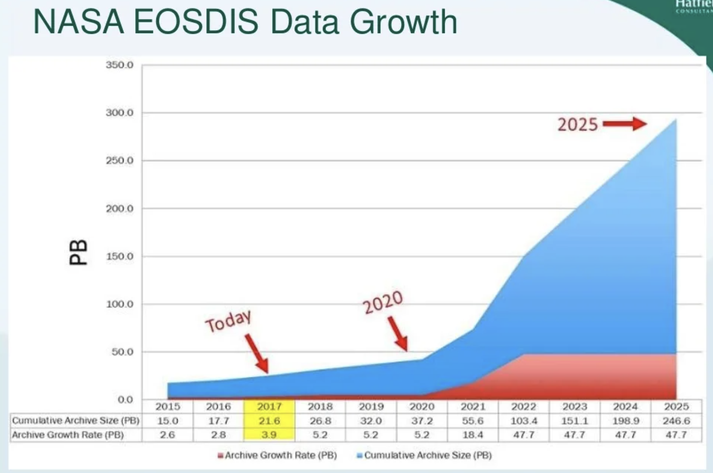
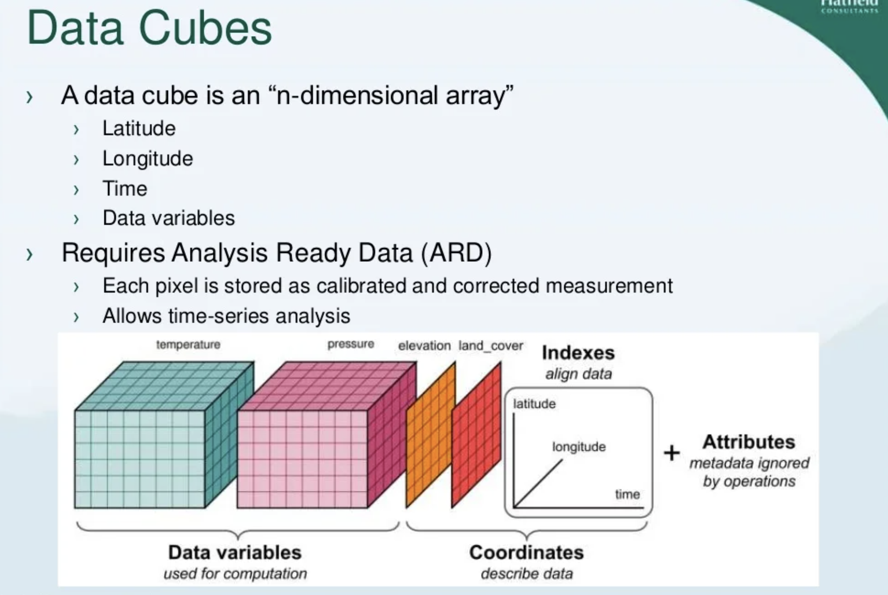

# 衛星データ形式

## 衛星データの種類

- ラスターデータ: 行と列の格子状に並んだピクセルで構成されるデータ

  - 衛星画像などの画像データなど
  - 拡張子は tiff や bmp
  - 8bit のグレースケール画像の場合、値は 0 から 255 までの範囲になる
  - 赤を表す 8bit のグレースケール、緑を表す 8bit のグレースケール、青を表す 8bit のグレースケールを組み合わせることで人間が見ている世界と同じ画像を表示できる
  - つまり３次元のデータ（row, column, channel）になる

- ベクターデータ: ポイント(位置)・ライン(道路)・ポリゴン(建物)で表される情報(フィーチャー)を表現するデータ

  - 拡張子が.shp のいわゆるシェープファイル(shapefile)。シェープファイルでは，ポリゴンなどの 1 つの形(フィーチャー)が 1 レコードとなっている
  - geopandas というのもある

- 地図タイル：衛星画像は Web 上でタイル上の画像として用いられることがある
  - Open Street Map(OMS)ではタイルの(0,0)は北西にあり、東に X 軸が伸び、南方向へ Y 正方向をとる


- そもそも TIFF とは
  Tagged Image File Format の略称。ラスターグラフィックやレイヤー情報を保存できる形式。サイズが大きいデメリットがある。

- 衛星データをどう保持しているか
  バンドごとに行列データを持っている？実物を見てイメージ図を書きたい。ヘッダやフッタやメタデータなど。

- 従来のデータアクセスの方法

  複数のファイル　 → Data Access Server ← 複数のクライアント

- データは一気に増える予測なので、従来の方法では限界がくる
  

- クラウドで扱いやすいサイズと操作感、そして Web で検索しやすいメタデータが求められている

## ファイル形式の種類

### Traditional

#### GeoTIFF

GeoTIFF は Tiff ファイルにジオリファレンス情報が埋め込まれた形式のファイル。
ジオリファレンス情報とは投影法、座標、楕円体、測地系、その他正確な位置情報を参照するための情報。

使われている衛星/センサ名

- ALOS/AVNIR-2、PRISM、PALSAR
- ALOS-2/PALSAR-2

- https://www.kkaneko.jp/db/heightmap/trygeotiff.html
- https://qiita.com/HidKamiya/items/d5e69fda61703abe1a58

#### NetCDF

Network Common Data Form の略で、配列指向の科学データを統合的に扱うことができるファイル形式。

[Unidata | NetCDF](https://www.unidata.ucar.edu/software/netcdf/)

使われている衛星/センサ名

- GCOM-C/SGLI

#### HDF

Hierarchical Data Format の略で、多様なコンピュータ環境で階層的なデータを取り扱うことができるファイル形式。

[The HDF Group - ensuring long-term access and usability of HDF data and supporting users of HDF technologies](https://www.hdfgroup.org/)

イリノイ大学で開発されたフォーマット。

複数のバンド情報が１つのファイルに格納されているため、読み出すには専用のソフトウェアが必要になる。

HDF4 と HDF5 の二つの異なるバージョンがあり、互いに互換性はない。

使われている衛星/センサ名

- GCOM-C/SGLI
- GCOM-W/AMSR2
- GSMaP

#### CEOS 準拠フォーマット

[CEOS](http://www.ceos.org/) （Committee on Earth Observation Satellites:地球観測衛星委員会）で標準化されたファイル形式。

バンド毎にファイルが分割される「CEOS-BSQ」と、複数のバンドが多重化された「CEOS-BIL」がある。

ファイル構成は衛星データ毎に設定され、詳細はプロダクトフォーマット説明書等に記載される。

使われている衛星/センサ名

- ADEOS/AVNIR
- ALOS/AVNIR-2、PRISM、PALSAR
- ALOS-2/PALSAR-2

### Modern

#### COG

公式ページ：[Cloud Optimized GeoTIFF](https://www.cogeo.org/)

HTTP サーバーで提供する向けに作られた GeoTIFF ファイル。
利点は２つ

- 衛星画像がタイル化されている（細切れのイメージ）ため必要な部分のみにアクセスできるため効率的に利用できる
- on-the-fly 処理が可能

  → レガシー処理（一度データをダウンロードしてメモリに保存する、処理を開始する、など）は不要になる

GDAL や RasterIO などでサポートされている。

#### STAC

[SpatioTemporal Asset Catalog](https://stacspec.org/)

地理情報データ群をまとめたデータ形式。メタデータを保存し、検索しやすくするためのソフトウェア。

従来の OGC 標準のメタデータ用ソフトウェア（CSW、OpenSearch）は JSON ではなく XML だったり、Web クローリングが不可だったり、RESTful ではなかったり、専門知識が必要だったりした。

そこで現代の要望に合わせて作られたものが STAC。COG のメタデータ版のようなもの。GIS に詳しくなくても扱いやすくなっている。

NASA の標準となっている CMR も STAC から呼べるようにライブラリが開発されている
[GitHub - nasa/cmr-stac](https://github.com/nasa/cmr-stac)

参考：https://zenn.dev/yonda/articles/0e5188d55f8492

#### ZARR

[Zarr — zarr 2.12.0 documentation](https://zarr.readthedocs.io/en/stable/)

N 次元配列の大規模データをチャンク化し、圧縮したファイル形式。

Numpy ベース

```python
import zarr
z = zarr.zeros((10000, 10000), chunks=(1000,1000), dtype="i4")
print(z)
# <zarr.core.Array (10000,10000) int32>
```

チャンク１つ１つをファイルとしてファイルシステムに保存するか、オブジェクトとしてクラウドに保存できる。
メタデータは json ファイルになっている。

NetCDF と HDF 形式から簡単に変換が可能なところが利点。

#### DataCube

DataCube の概要。ただの３次元データではなく、n 次元的にその他の情報も含まれている。


OpenDataCube をはじめ、Xarray や Xcube、Rasdaman といったソフトウェアでデータキューブ形式を扱えるようになっている。

参考：https://github.com/opendatacube/datacube-notebooks

## 参考

- [ファイル形式の紹介 – JAXA 第一宇宙技術部門 Earth-graphy](https://earth.jaxa.jp/ja/eo-knowledge/file-format/index.html)
- [STAC, ZARR, COG, K8S and Data Cubes: The brave new world of satellite…](https://www.slideshare.net/geoanalyticsca/stac-zarr-cog-k8s-and-data-cubes-the-brave-new-world-of-satellite-eo-analytics-in-the-cloud-geoalberta-2019)
