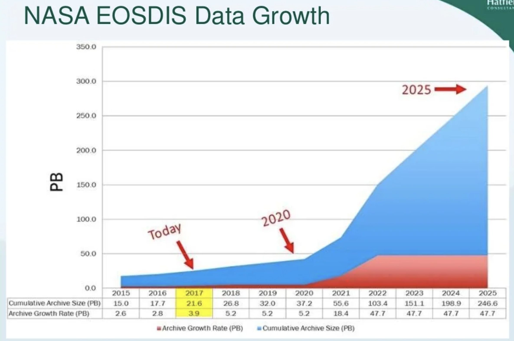
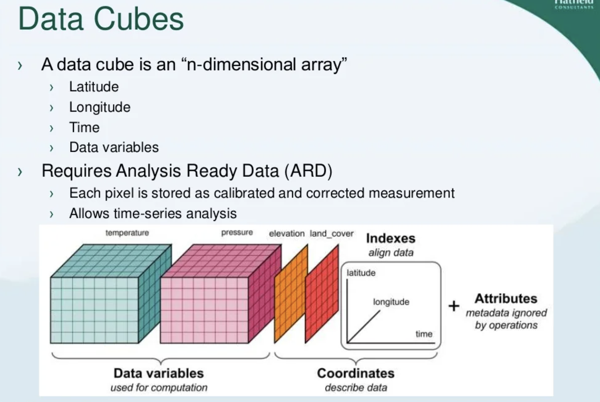

# 衛星データ形式

## BackGround

- そもそも TIFF とは
  Tagged Image File Format の略称。ラスターグラフィックやレイヤー情報を保存できる形式。サイズが大きいデメリットがある。

- 衛星データをどう保持しているか
  バンドごとに行列データを持っている？実物を見てイメージ図を書きたい。ヘッダやフッタやメタデータなど。

- 従来のデータアクセスの方法

  複数のファイル　 → Data Access Server ← 複数のクライアント

- データは一気に増える予測なので、従来の方法では限界がくる
  

- クラウドで扱いやすいサイズと操作感、そして Web で検索しやすいメタデータが求められている

## ファイル形式の種類

### Traditional

- GeoTIFF

  GeoTIFF は Tiff ファイルにジオリファレンス情報が埋め込まれた形式のファイル。
  ジオリファレンス情報とは投影法、座標、楕円体、測地系、その他正確な位置情報を参照するための情報。

  使われている衛星/センサ名

  - ALOS/AVNIR-2、PRISM、PALSAR
  - ALOS-2/PALSAR-2

- NetCDF

  Network Common Data Form の略で、配列指向の科学データを統合的に扱うことができるファイル形式。

  [Unidata | NetCDF](https://www.unidata.ucar.edu/software/netcdf/)

  使われている衛星/センサ名

  - GCOM-C/SGLI

- HDF

  Hierarchical Data Format の略で、多様なコンピュータ環境で階層的なデータを取り扱うことができるファイル形式。

  [The HDF Group - ensuring long-term access and usability of HDF data and supporting users of HDF technologies](https://www.hdfgroup.org/)

  イリノイ大学で開発されたフォーマット。

  複数のバンド情報が１つのファイルに格納されているため、読み出すには専用のソフトウェアが必要になる。

  HDF4 と HDF5 の二つの異なるバージョンがあり、互いに互換性はない。

  使われている衛星/センサ名

  - GCOM-C/SGLI
  - GCOM-W/AMSR2
  - GSMaP

- CEOS 準拠フォーマット

  [CEOS](http://www.ceos.org/) （Committee on Earth Observation Satellites:地球観測衛星委員会）で標準化されたファイル形式。

  バンド毎にファイルが分割される「CEOS-BSQ」と、複数のバンドが多重化された「CEOS-BIL」がある。

  ファイル構成は衛星データ毎に設定され、詳細はプロダクトフォーマット説明書等に記載される。

  使われている衛星/センサ名

  - ADEOS/AVNIR
  - ALOS/AVNIR-2、PRISM、PALSAR
  - ALOS-2/PALSAR-2

## Modern

- COG

  公式ページ：[Cloud Optimized GeoTIFF](https://www.cogeo.org/)

  HTTP サーバーで提供する向けに作られた GeoTIFF ファイル。
  利点は２つ

  - 衛星画像がタイル化されている（細切れのイメージ）ため必要な部分のみにアクセスできるため効率的に利用できる
  - on-the-fly 処理が可能

    → レガシー処理（一度データをダウンロードしてメモリに保存する、処理を開始する、など）は不要になる

  GDAL や RasterIO などでサポートされている。

- STAC

  [SpatioTemporal Asset Catalog](https://stacspec.org/)

  地理情報データ群をまとめたデータ形式。メタデータを保存し、検索しやすくするためのソフトウェア。

  従来の OGC 標準のメタデータ用ソフトウェア（CSW、OpenSearch）は JSON ではなく XML だったり、Web クローリングが不可だったり、RESTful ではなかったり、専門知識が必要だったりした。

  そこで現代の要望に合わせて作られたものが STAC。COG のメタデータ版のようなもの。GIS に詳しくなくても扱いやすくなっている。

  NASA の標準となっている CMR も STAC から呼べるようにライブラリが開発されている
  [GitHub - nasa/cmr-stac](https://github.com/nasa/cmr-stac)

- ZARR

  [Zarr — zarr 2.12.0 documentation](https://zarr.readthedocs.io/en/stable/)

  N 次元配列の大規模データをチャンク化し、圧縮したファイル形式。

  Numpy ベース

  ```python
  import zarr
  z = zarr.zeros((10000, 10000), chunks=(1000,1000), dtype="i4")
  print(z)
  # <zarr.core.Array (10000,10000) int32>
  ```

  チャンク１つ１つをファイルとしてファイルシステムに保存するか、オブジェクトとしてクラウドに保存できる。
  メタデータは json ファイルになっている。

  NetCDF と HDF 形式から簡単に変換が可能なところが利点。

- DataCube

  DataCube の概要。ただの３次元データではなく、n 次元的にその他の情報も含まれている。
  

  OpenDataCube をはじめ、Xarray や Xcube、Rasdaman といったソフトウェアでデータキューブ形式を扱えるようになっている。

## 参考

- [ファイル形式の紹介 – JAXA 第一宇宙技術部門 Earth-graphy](https://earth.jaxa.jp/ja/eo-knowledge/file-format/index.html)
- [STAC, ZARR, COG, K8S and Data Cubes: The brave new world of satellite…](https://www.slideshare.net/geoanalyticsca/stac-zarr-cog-k8s-and-data-cubes-the-brave-new-world-of-satellite-eo-analytics-in-the-cloud-geoalberta-2019)
